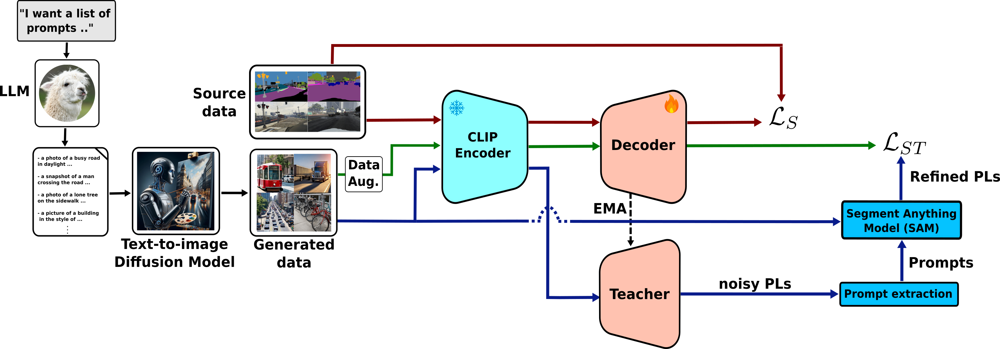

# Collaborating Foundation models for Domain Generalized Semantic Segmentation

[](https://paperswithcode.com/sota/domain-generalization-on-gta-to-avg?p=collaborating-foundation-models-for-domain)

This repository contains the code for the paper: [Collaborating Foundation models for Domain Generalized Semantic Segmentation](https://arxiv.org/abs/2312.09788).

## Overview

**Domain Generalized Semantic Segmentation** (DGSS)
deals with training a model on a labeled source domain
with the aim of generalizing to unseen domains during inference.
Existing DGSS methods typically effectuate robust
features by means of Domain Randomization (DR). Such an
approach is often limited as it can only account for style
diversification and not content. In this work, we take an
orthogonal approach to DGSS and propose to use an assembly of
**C**o**L**laborative F**OU**ndation models for **D**omain
Generalized **S**emantic Segmentation (**CLOUDS**). In detail,
**CLOUDS** is a framework that integrates FMs of various
kinds: (i) CLIP backbone for its robust feature represen-
tation, (ii) text-to-image generative models to diversify the
content, thereby covering various modes of the possible target
distribution, and (iii) Segment Anything Model (SAM)
for iteratively refining the predictions of the segmentation
model. Extensive experiments show that our CLOUDS excels in
adapting from synthetic to real DGSS benchmarks
and under varying weather conditions, notably outperforming
prior methods by 5.6% and 6.7% on averaged mIoU,
respectively.


<div style="text-align: center;">

</div>

## Installation

See [installation instructions](INSTALL.md).

## Getting Started

See [Preparing Datasets for CLOUDS](datasets/README.md).

See [Getting Started with CLOUDS](GETTING_STARTED.md).

## Checkpoints

We provide the following checkpoints for CLOUDS:

* [CLOUDS for GTA Domain Generalization](...)
* [CLOUDS for SYNTHIA Domain Generalization](...)
* [CLOUDS for Cityscapes Domain Generalization](...)

## Citation 

If you find our work useful in your research, please consider citing:
```
@InProceedings{Benigmim_2024_CVPR,
    author    = {Benigmim, Yasser and Roy, Subhankar and Essid, Slim and Kalogeiton, Vicky and Lathuili\`ere, St\'ephane},
    title     = {Collaborating Foundation Models for Domain Generalized Semantic Segmentation},
    booktitle = {Proceedings of the IEEE/CVF Conference on Computer Vision and Pattern Recognition (CVPR)},
    month     = {June},
    year      = {2024},
    pages     = {3108-3119}
}
```

## Relevant Files :

[train_net.py](train_net.py) : The training script of CLOUDS

[clouds/clouds.py](clouds/clouds.py) : This file defines the model class and its forward function, which forms the
core of our model's architecture and forward pass logic

[generate_txt_im.py](generate_txt_im.py) : The script to generate a dataset using Stable Diffusion

[prompt_llama70b.txt](prompt_llama70b.txt) : The text file containing 100 generated prompts using Llama70b-Chat


## To-do list
- [x] Release code
  
- [ ] Release checkpoints and training logs

- [ ] Release generated dataset

</details>

## Acknowledgements
CLOUDS draws its foundation from the following open-source projects, and we'd like to acknowledge their 
authors for making their source code available :

[FC-CLIP](https://github.com/bytedance/fc-clip)

[Mask2Former](https://github.com/facebookresearch/Mask2Former)

[HRDA](https://github.com/lhoyer/HRDA)
